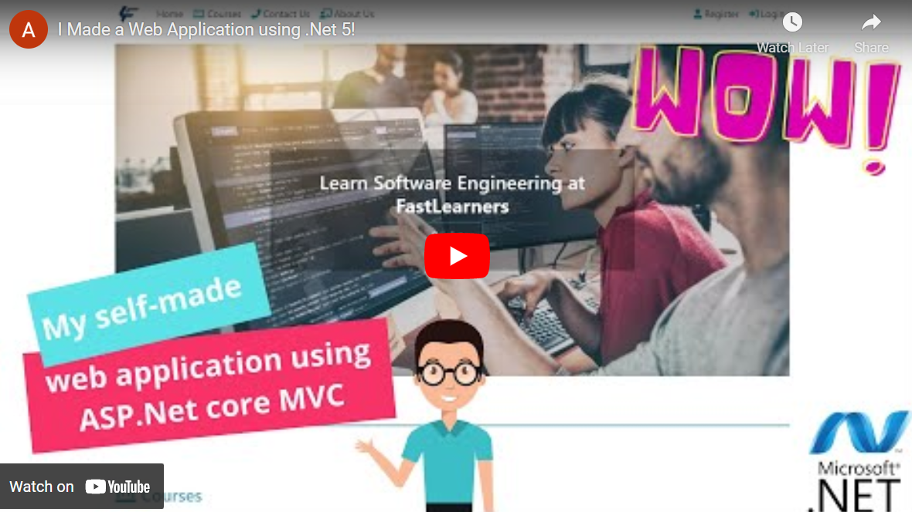

# FastLearners Web App
 
A web application using .net 5
 
 This is a web application that provides a platform for learning programming languages and technologies including Videos and articles.

## Introduction
To watch the Introduction Video click on the image below.

     

## Features
* [C#](https://docs.microsoft.com/en-us/dotnet/csharp/)
* [ASP.NET Core 5](http://www.dot.net/)
* [Entity Framework Core](https://docs.efproject.net/en/latest/)
* [LINQ](https://docs.microsoft.com/en-us/dotnet/csharp/programming-guide/concepts/linq/)
* [Sql Server](https://www.microsoft.com/en-us/sql-server/sql-server-2019)
* [Asp.Net core Identity](https://docs.microsoft.com/en-us/aspnet/core/security/authentication/identity)
* [JavaScript](https://www.javascript.com/)
* [JQuery](https://jquery.com/)
* [AJAX](https://api.jquery.com/jquery.ajax/)
* [HTML](https://www.w3schools.com/html/html_intro.asp)
* [Razor](https://docs.microsoft.com/en-us/aspnet/core/mvc/views/razor?view=aspnetcore-6.0)
* [Bootstrap](https://getbootstrap.com/)
* [CSS](https://www.w3schools.com/css/css_intro.asp)
* [Responsive web design](https://www.w3schools.com/html/html_responsive.asp)
* [SmarterASP.NET Host](https://www.smarterasp.net/)
* [Font Awesome](https://fontawesome.com/)
* [GUID](https://www.guidgenerator.com/)

## Pre-requisites
1. [.Net SDK](https://www.microsoft.com/net/core#windows)
2. [Visual studio 2019](https://www.visualstudio.com/) OR [VSCode](https://code.visualstudio.com/) with [C#](https://marketplace.visualstudio.com/items?itemName=ms-vscode.csharp) extension
3. [Microsoft SQL Server](https://www.microsoft.com/en-us/sql-server)

## Installation

1. Clone the repo:

   git clone https://github.com/Ali-Pourgheysari/FastLearnersMVCWebApplication.git

2. Change directory:

   cd FastLearnersMVCWebApplication

3. Restore packages:

   dotnet restore FastLearnersMVCWebApplication.sln

4. Target Microsoft SQL Server:

    - Run with Microsoft SQL Server:
    - Delete `Migrations` folder from FastLearnersMVCWebApplication\Data
    - Change setting in appsettings.json, change `Web` connection string to your local Sql Server connection string

5. Once the project is running first try to add an admin to the database:

    - Register as a new user
    - Go to database Management Studio
    - Open the related database
    - Copy Id Property of Registered user (That is a GUID) in AspNetUsers Table and paste it into UserId Property in AspNetUserRoles table 
    - Make a [GUID](https://www.guidgenerator.com/) for Id Property in AspNetRoles and insert following values in this table:
        - Id: GUID
        - Name: Admin
        - NormalizedName: ADMIN
    - Copy Id Property of admin in AspNetRoles table and paste it into RoleId Property in AspNetUserRoles table
   Note: For production use Identity server hosted with appropriate configuration.

Here is the database schema:

